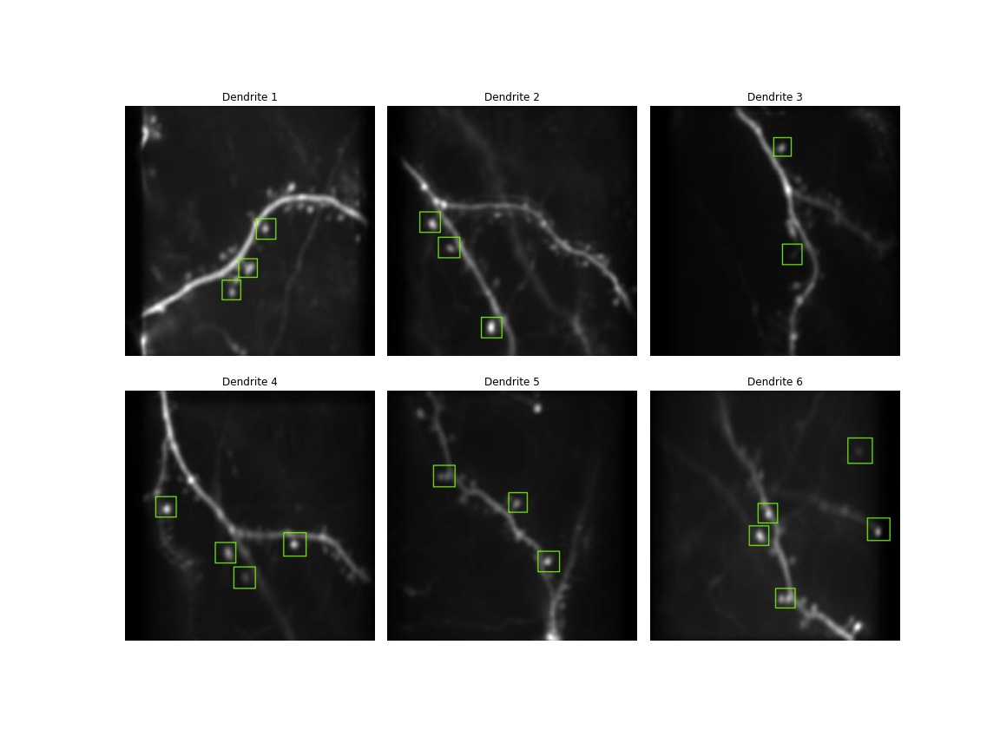

# Dendrite Spine Identification Project

### Automating annotating dendritic spines in images using Faster Recurrent Convolutional Neural Networks (Faster RCNNs) & TensorFlow Object Detection

To test the project, simply run this [notebook](https://github.com/GoldinGuy/SpineObjectDetection/blob/master/dendrite_indentification.ipynb)

For development setup, follow [these well-written instructions](https://medium.com/@daniel.schwalm/installing-the-tensorflow-object-detection-api-on-windows-10-443750faf7b8). Fair warning - it's a pain. You'll need to install many deps that pip doesn't include, mess with the PATH and PYTHONPATH, and run some generative commands.

This work is heavily based on the following projects:

- [Deep Learning For Dendritic Spines Detection](https://github.com/ily-R/Deep-Learning-for-Dendritic-Spines-Detection/blob/master/report.pdf)
- [Faster R-CNN: Towards Real-Time Object Detection with Region Proposal Networks](https://arxiv.org/abs/1506.01497)
- [Automated dendritic spine detection using convolutional neural networks on maximum intensity projected microscopic volumes](https://web.stanford.edu/group/rubinlab/pubs/Xiao-2018-Automated.pdf)
- [Object Detection Demo](https://github.com/Tony607/object_detection_demo)
- [Google Object Detection Tutorial](https://github.com/tensorflow/models/blob/master/research/object_detection/colab_tutorials/object_detection_tutorial.ipynb)
- [Tensorflow Object Detection Tutorial](https://awesomeopensource.com/project/pythonlessons/TensorFlow-object-detection-tutorial)
- [@datitran's Object Detection Project](https://github.com/datitran/object_detector_app/blob/master/object_detection_app.py)
- [Image Object Detection Using Tensorflow-trained Classifier](https://github.com/EdjeElectronics/TensorFlow-Object-Detection-API-Tutorial-Train-Multiple-Objects-Windows-10/blob/master/Object_detection_image.py)
- [Zero to Hero: Guide to Object Detection using Deep Learning: Faster R-CNN,YOLO,SSD](https://cv-tricks.com/object-detection/faster-r-cnn-yolo-ssd/)
- [Dendritic Spine Analysis Dataset](https://github.com/mughanibu/Dendritic-Spine-Analysis-Dataset)

Full credit and gratitude to all who worked on the above.
